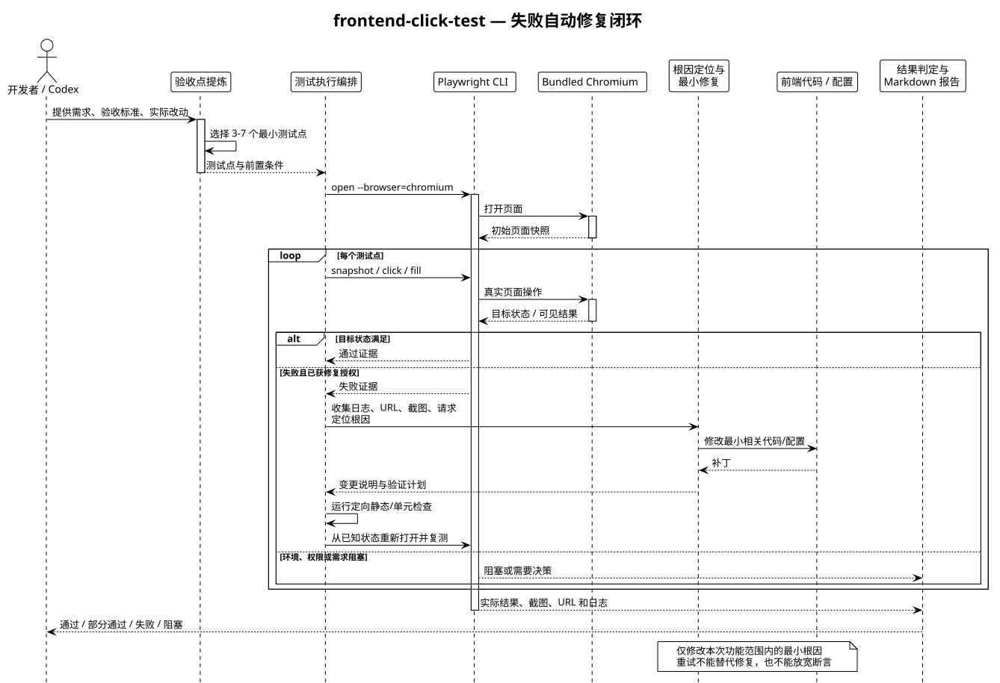

# 前端点击测试架构

## 目标

`frontend-click-test` 面向已经完成实现和常规代码验证的前端功能点，确认用户能否通过真实页面完成主要操作，并观察用户可见结果。当前任务授权修复时，失败会进入根因定位、最小修改和真实浏览器复测闭环。

它是定向验收层，不替代单元测试、组件测试、接口测试、性能测试、安全测试或全站回归测试。

## 职责边界

| 模块 | 职责 | 不负责 |
|---|---|---|
| 需求与代码改动 | 提供功能范围、前置条件和验收目标 | 不直接证明页面已经通过测试 |
| `frontend-click-test` | 提炼 3–7 个最小测试点，规定操作顺序、断言和结果分类 | 不扩大为未要求的回归或专项审计 |
| Playwright CLI | 管理浏览器会话，执行打开页面、快照、点击、输入、导航和截图等动作 | 不替代应用自身测试框架 |
| bundled Chromium | 提供真实页面渲染、交互和可见状态 | 不应被静态页面或源码阅读结果替代 |
| Markdown 报告 | 记录实际操作、预期、实际结果、状态和证据 | 不把未执行的检查标为通过 |

## 运行数据流

1. 从用户需求、验收要求和本次代码改动中确定功能边界。
2. 为该功能选择一条主要成功路径，以及必要的直接相关边界或失败路径。
3. 检查 Playwright CLI、Chromium、应用服务、账号和测试数据是否可用。
4. 通过 `snapshot` 获取当前页面引用，再按照用户顺序执行真实操作。
5. 在导航、弹窗、提交或异步状态变化后重新获取页面快照。
6. 记录可见结果；失败时补充截图、URL、控制台、请求或 trace 等复现证据。
7. 关闭浏览器会话并输出 `通过`、`部分通过`、`失败` 或 `阻塞` 报告。

## 失败闭环

失败后先从已知状态复现并保存证据，再分类根因。属于本次功能且已获修复授权时，只修改最小相关代码、配置或稳定定位器，先执行定向静态/单元/组件检查，再重新运行原失败点和受影响测试点。

环境、账号、权限、数据或浏览器不可用时不修改产品代码；需求歧义、未授权副作用、范围外问题、同一失败无变化或没有新证据时停止。默认同一功能最多修复 5 轮，报告每轮的根因分类、变更和验证结果。

## 状态定义

| 状态 | 含义 |
|---|---|
| `通过` | 声明范围内的操作已由真实 Chromium 执行，用户可见预期结果出现，未发现本次功能范围内的问题 |
| `部分通过` | 至少一个测试点通过，但另一个已执行测试点失败或存在未解决问题 |
| `失败` | 已具备执行条件，但主要路径或关键断言未通过 |
| `阻塞` | CLI、Chromium、服务、账号或安全测试数据不可用，无法完成真实浏览器验证 |

重试只能用于诊断，不能把“重试后通过”直接当作稳定通过。未执行的测试点必须保留为未执行或阻塞状态。

## 安全边界

- 默认使用临时浏览器会话，不保存登录状态。
- 只有在安全测试环境和专用测试账号下，才允许使用持久化会话或状态保存。
- 不对生产环境执行写入、删除、支付或发送消息等有副作用的操作。
- 截图、trace、网络记录和报告不得包含 Cookie、Token、密码、API Key 或真实个人信息。
- 需要副作用操作时，先改用安全测试环境或取得明确授权。

## 可维护性约束

定位器优先使用 role、label、accessible name，以及团队稳定维护的 `data-testid` 或 `aria-*`。等待目标状态，不用固定睡眠掩盖应用未就绪；页面状态改变后重新获取快照，避免复用旧引用。

架构图源文件位于 [`docs/diagrams/frontend-click-test-flow.puml`](../diagrams/frontend-click-test-flow.puml)。
