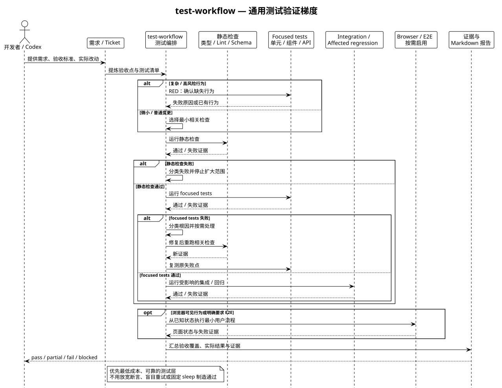

# 通用测试工作流架构

## 目标

`test-workflow` 面向后端、前端、API、库和 CLI 等仓库变更，从需求、Ticket 功能清单、验收标准和现有契约中提炼最小高价值测试集，并按成本从低到高逐层验证。浏览器验证只在行为对用户可见或验收明确要求端到端流程时启用。

## 核心数据流

1. 从需求、验收标准和本次实际改动中确定行为契约。
2. 选择 3–7 个高价值测试点，覆盖主要成功路径及直接相关的边界或失败路径。
3. 依次尝试静态检查、focused tests、受影响的集成/回归检查，以及按需的 Browser / E2E。
4. 每个验收点都关联实际执行过的检查或观察证据；未执行的检查不能标为通过。
5. 汇总结果并按 `pass`、`partial`、`fail` 或 `blocked` 分类。

## 验证梯度

| 层级 | 主要用途 | 典型证据 |
|---|---|---|
| 静态检查 | 尽早发现编译、类型、Lint、Schema 或配置问题 | 命令输出、错误位置和修复后的重新检查 |
| Focused tests | 验证本次变更直接影响的单元、组件、API 或包契约 | 测试结果、断言和失败堆栈 |
| Integration / regression | 覆盖数据库、文件系统、队列、网络或受影响模块边界 | 集成测试、受影响模块回归结果 |
| Browser / E2E | 仅验证真实用户可见交互或明确要求的端到端流程 | 页面状态、URL、截图、控制台/请求或 trace |

优先使用能可靠证明行为的最低成本层，不把全量回归或浏览器 E2E 当作所有变更的默认反馈循环。

## 风险分支

- 微小变更：运行最接近的现有检查；只有行为容易复发时才补回归测试。
- 普通行为变更：先定义契约和 focused tests，再运行受影响的回归检查。
- 复杂或高风险行为：实际可行时采用 RED -> GREEN，先确认测试能捕获缺失行为，再实施最小修复。
- 浏览器可见行为：低层检查通过后，再使用最小真实用户流程补充浏览器验证。

## 失败处理

失败先分类，再决定是否修改：实现缺陷修产品代码，测试缺陷修测试，回归问题修复或停止，环境/数据不可用则标记阻塞，需求或设计冲突则重新规划。修复应保持范围最小，并重新运行原失败点和受影响检查；不得通过放宽断言、删除测试、盲目重试或固定等待制造通过。

## 与前端点击测试的关系

`frontend-click-test` 是本工作流的专用浏览器分支，补充真实 Chromium 中的页面操作、可见状态观察和失败自动修复闭环。通用测试策略参见[运行手册](../testing/test-workflow.md)；前端细节参见[前端点击测试架构](frontend-click-test.md)和[运行手册](../testing/frontend-click-test.md)。

## 维护边界

测试报告只记录实际执行的操作和证据。页面地址、账号、Cookie、Token、个人信息和真实业务数据使用占位符；公开图源和文档不应包含凭据或内部业务信息。

图源位于 [`docs/diagrams/test-workflow-flow.puml`](../diagrams/test-workflow-flow.puml)。
